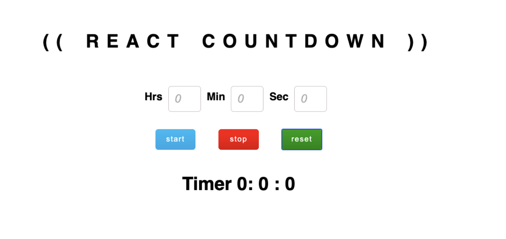

# REACT COUNTDOWN
- **Live demo**: https://unrivaled-travesseiro-3cb6b8.netlify.app/
- The React Countdown application comprises the following components:
    - **Timer Component**: counting down seconds and calculating other time units.
    - **Setter Component**: set the initial countdown time.
    - **Finally, App Component**: Manages and controls the overall countdown functionality.
- Image of expected result.

